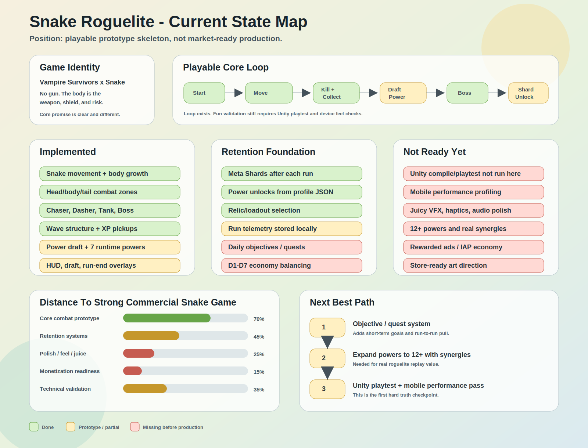

# Snake Roguelite Prototype

A mobile-first roguelite prototype where the snake's body is not just a tail. It is the weapon, shield, risk surface, and build engine.

Core promise:

> You have no gun. Your body is the weapon.

This project explores a one-finger, run-based mobile game inspired by survival roguelites, but with a mechanical twist: growing longer makes the player stronger and more vulnerable at the same time.



## Current Status

This repository contains the prototype foundation, not a production-ready store build.

Implemented:

- Snake movement, body growth, and head/body/tail combat zones.
- Enemy wave structure with Chaser, Dasher, Tank, and Boss prototypes.
- XP pickups, level-up flow, and draft-based power selection.
- Runtime power effects for early build variety.
- Local run telemetry for playtest analysis.
- Meta Shards, unlockable powers, and relic/loadout foundation.
- Prototype HUD, draft overlay, boss overlay, run-end overlay, and feedback hooks.

Still pending:

- Unity editor compile/playtest validation.
- Mobile device profiling for FPS, heat, memory, and touch feel.
- Additional power synergies and balance passes.
- Juicy VFX, haptics, animation polish, and production audio.
- Analytics SDKs, rewarded ads, IAP, and live economy systems.
- Store-ready art direction and full Unity project settings/package setup.

## Game Pillars

- `Body as weapon`: The snake damages enemies through head hits and body contact.
- `Length as risk`: More body means more damage potential, but a larger weak surface.
- `Fast runs`: Target session length is 4-6 minutes.
- `Draft decisions`: Level-ups offer power choices that shape each run.
- `Meta variety`: Long-term progression unlocks new powers and relics without replacing skill.

## Core Loop

```text
Move -> Kill enemies -> Collect XP -> Level up -> Choose power -> Survive waves -> Beat boss -> Earn Meta Shards -> Unlock new options -> Play again
```

## Repository Structure

```text
.
├── docs/
│   ├── current_state_map.md
│   ├── mvp_spec.md
│   ├── product_brief.md
│   ├── prototype_enemy_values.md
│   ├── prototype_power_values.md
│   ├── prototype_relic_values.md
│   ├── retention_monetization.md
│   ├── sprint_01.md
│   ├── technical_architecture.md
│   └── unity_scene_setup.md
└── unity/
    └── Assets/_Game/
        ├── Audio/
        ├── Core/
        ├── Editor/
        ├── Gameplay/
        ├── Meta/
        ├── Telemetry/
        └── UI/
```

## Key Documents

- [Product Brief](docs/product_brief.md): Game identity, target audience, core loop, and differentiation.
- [MVP Spec](docs/mvp_spec.md): First playable scope and acceptance criteria.
- [Technical Architecture](docs/technical_architecture.md): Unity module boundaries and performance notes.
- [Current State Map](docs/current_state_map.md): Visual map of what exists, what is partial, and what is missing.
- [Unity Scene Setup](docs/unity_scene_setup.md): How to assemble the prototype scene in Unity.
- [Power Values](docs/prototype_power_values.md): Starting values for prototype powers.
- [Enemy Values](docs/prototype_enemy_values.md): Starting values for enemies and boss tuning.
- [Relic Values](docs/prototype_relic_values.md): Starting values for pre-run relic/loadout design.

## Unity Setup

The repository currently stores the prototype gameplay source under `unity/Assets/_Game`.

Recommended local setup:

1. Create or open a Unity project.
2. Ensure the `Assets/_Game` folder exists under the Unity project.
3. Use the scripts in `unity/Assets/_Game`.
4. In Unity, run `Snake Roguelite > Setup Prototype Demo Scene` from the editor menu.
5. Press Play and validate the first-run loop.

See [Unity Scene Setup](docs/unity_scene_setup.md) for the detailed setup checklist.

## Development Roadmap

Next priorities:

1. Add objective/quest system for short-term replay goals.
2. Expand from prototype powers to at least 12 meaningful powers.
3. Improve moment-to-moment feel: hit flash, screen shake, pickup magnet, audio pitch, haptics.
4. Balance the first 10 runs using telemetry targets.
5. Validate performance on real Android and iOS devices.
6. Add rewarded ad and starter economy only after core fun is proven.

## Validation Goal

The first prototype has one main success question:

> When a tester finishes a run, do they want to play one more?

If the answer is no, the solution is not monetization or more meta systems. The solution is stronger combat feel, clearer power synergies, and better near-miss moments.

## Notes

- This is an early-stage prototype for game design validation.
- The project is not affiliated with Vampire Survivors or poncle.
- Large binary assets should be tracked with Git LFS before production art/audio/model files are added.
