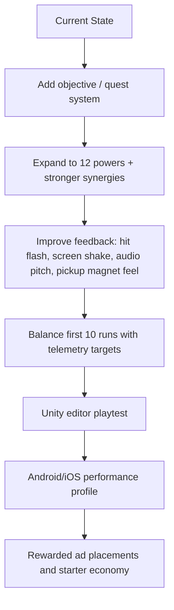

# Current State Map

This document shows where the prototype stands right now, what is playable, what is only scaffolded, and what should be built next.

## One-Line Status

The project is past pure paper design and has a playable Unity prototype skeleton: snake movement, body combat, enemy waves, boss, XP pickups, draft powers, local telemetry, meta shards, and relic/loadout are in place. It is not production-ready yet because Unity playtest, mobile performance profiling, balancing, juiciness, and monetization systems are still missing.

## Build Map

```mermaid
flowchart LR
    A["Run Start"] --> B["Move Snake"]
    B --> C["Body = Weapon + Shield"]
    C --> D["Kill Enemies"]
    D --> E["Collect XP Pickups"]
    E --> F["Level Up"]
    F --> G["Choose 1 of 3 Powers"]
    G --> H["Grow / Synergy / Survive"]
    H --> I["Boss Encounter"]
    I --> J["Run End"]
    J --> K["Meta Shards"]
    K --> L["Unlock Powers + Relics"]
    L --> A
```

## Current Implementation Status

```mermaid
flowchart TB
    Core["Core Gameplay"]
    Meta["Meta Progression"]
    UX["Prototype UI / Feedback"]
    Data["Telemetry / Data"]
    Missing["Missing Before Real Market Test"]

    Core --> C1["Snake movement: done"]
    Core --> C2["Body/head/tail combat: done"]
    Core --> C3["Chaser/Dasher/Tank enemies: done"]
    Core --> C4["Wave + boss run structure: done"]
    Core --> C5["XP pickup collection: done"]
    Core --> C6["Runtime power effects: partial"]

    Meta --> M1["Meta Shards: done"]
    Meta --> M2["Power unlocks: done"]
    Meta --> M3["Relic/loadout: done"]
    Meta --> M4["Daily objectives: next"]

    UX --> U1["HUD: prototype"]
    UX --> U2["Draft screen: prototype"]
    UX --> U3["Run end screen: prototype"]
    UX --> U4["Juicy VFX/SFX polish: missing"]

    Data --> D1["Local run telemetry JSON: done"]
    Data --> D2["Selected power/relic tracking: done"]
    Data --> D3["Analytics SDK: missing"]

    Missing --> X1["Unity editor compile/playtest"]
    Missing --> X2["Mobile device performance"]
    Missing --> X3["12+ power build variety"]
    Missing --> X4["Economy balancing"]
    Missing --> X5["Rewarded ads / IAP"]
```

## Next Development Path

## Practical Read

- `Core combat`: medium-strong prototype foundation.
- `Retention`: started through shards, unlocks, and relics; still needs daily objectives and more content.
- `Monetization`: intentionally not added yet; premature until first-session fun is verified.
- `Production quality`: not close yet; current goal is proving repeat-run desire, not store launch.
- `Next best feature`: objective/quest system, because it gives short-term goals and raises replay intent without needing backend or art.
